# 🎬 ZeroPlay

### Movies. Live TV. Live Sports. One place.

**Movies, series, anime, LIVE TV, PPV/Sports, and Live Sports in one app.** ZeroPlay brings TMDB discovery, your personal library, and embedded playback together in a clean interface for **Android, Android TV / Google TV, and Windows**.

Browse trending picks, explore genres, save a watchlist, or roll the 🎲 **Surprise Me** dice when you cannot decide. Softly blurred artwork, light and dark themes, and dedicated TV controls make it comfortable on your phone, desktop, or big screen.

**[⬇️ Download the latest release](https://github.com/Zer0Spce/ZeroPlay/releases/latest)** · **[📋 v1.6.1 release notes](docs/release-1.6.1.md)** · **[📺 TV controls](docs/android-tv-controls.md)**

Previously **ZeroMovies**. ZeroPlay updates keep existing Android installations, Windows library data, and the permanent signing key.

## ✨ Features

| | What you can do |
| --- | --- |
| 🔎 **Discover & search** | Browse trending, popular, now-playing, recommended, and coming-soon titles, or search movies and TV series through TMDB. |
| 🎲 **Surprise Me** | Discover released movies beyond the homepage rows with the red dice button beside the theme toggle. |
| 🗂️ **Categories** | Explore movie and TV genres, including Anime cards in both grids. Artwork makes categories easy to browse, and more titles load as you scroll. |
| 📡 **Live PPV & Live TV** | Two dedicated tabs using the ZeroStreams playlists, colored refresh buttons, channel groups, and in-app playback on Android, Android TV and Windows. |
| 🏟️ **Live Sports** | Event categories, posters, local schedules, labeled alternate sources, fullscreen playback, and a fresh API request every time you press Refresh sports. |
| ⭐ **Favorite channels** | Star LIVE TV channels and browse your Favorites group. |
| ⚙️ **Homepage panels** | Keep the default layout or enable extra Action, Comedy, Horror, Animation, and Anime rows in Settings. |
| 🎞️ **Rich title details** | View artwork, ratings, synopsis, cast, genres, trailers, and related recommendations. |
| ▶️ **Choose your source** | Switch beside Watch Now between **VidStuck · Recommended**, VidSrc.to, VidSrc.sh, and SuperEmbed. |
| ❤️ **Your library** | Save a watchlist, organize collections and Plan to Watch, and revisit watch and search history. |
| ⏯️ **Continue Watching** | Return to started titles and resume where supported by the playback provider. |
| 🌗 **Make it yours** | Saved light/dark mode, a compact theme toggle, and subtle blurred backgrounds. |
| 🛡️ **Advertisement filtering** | Block known advertising requests and redirects, and remove explicit banner/ad slots, popups, and recognized timed QR overlays in supported app playback environments. |
| 📺 **TV remote support** | D-pad navigation and optional player mouse mode; idle controls hide and wake on remote input. |
| 🖥️ **Windows portable** | Browse and play in one window, use native fullscreen, and return with the player Back button. No installer. |
| 🔊 **Optional audio boost** | Off, 1.5×, or 2× for compatible embedded audio. |

Search runs when you press **Search** (or the keyboard Search action), and movie, series, genre, provider, and search lists load more near the bottom without page buttons. The two live tabs include dedicated refresh controls and preserve saved channels when a refresh fails.

## 📸 Android, Android TV & Windows

These screenshots come from the running v1.6.0 apps: Android mobile/TV emulators and the Windows desktop build. Android is captured at **1080 × 1920** and Android TV at **1920 × 1080**. Original PNG files retain their native resolution with no resizing or recompression; phone previews are displayed smaller on this page. Click any image for the full-size original.

### 📱 Android · discovery and your homepage

Browse artwork, find a movie, change playback sources, and make the homepage your own.

<a href="docs/screenshots/android-mobile-home.png">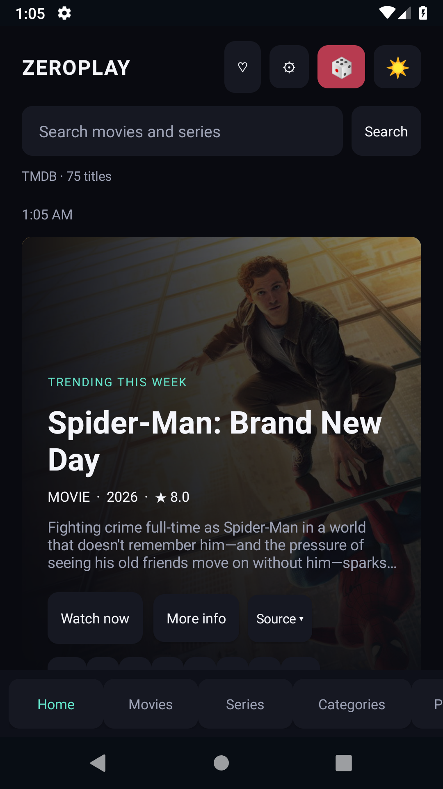</a>

### 🖥️ Windows · one app for your next watch

Discover movies and series, switch to LIVE TV or Live Sports, and keep your library close.

[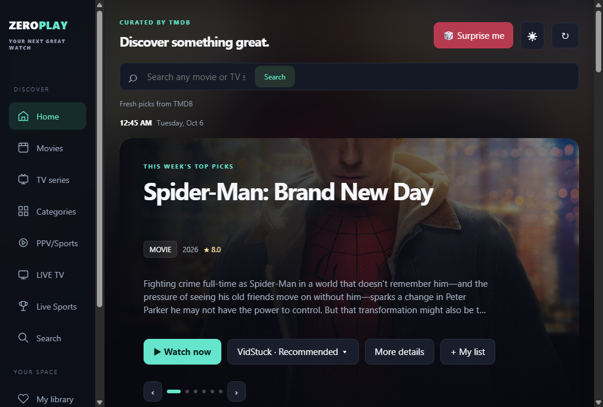](docs/screenshots/windows-home.png)

### 🏟️ Android TV · compact Live Sports

Four-column cards match PPV/Sports. Browse sports categories, event schedules, posters, and alternate sources with a remote.

[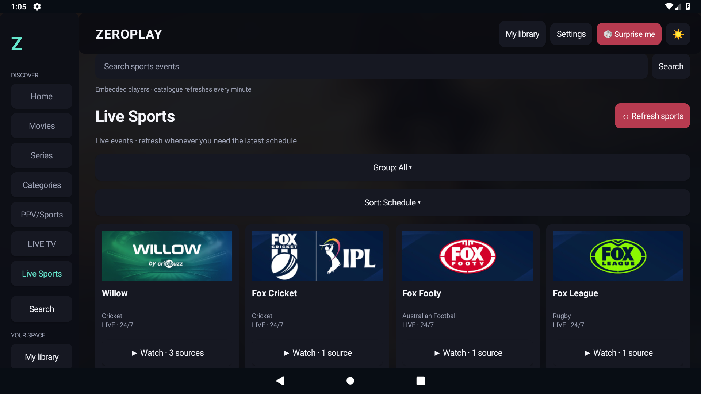](docs/screenshots/android-tv-live-sports.png)

### 🗂️ Artwork-rich categories

Browse alphabetical movie and series categories through artwork cards. Anime and six language collections use this same grid layout.

[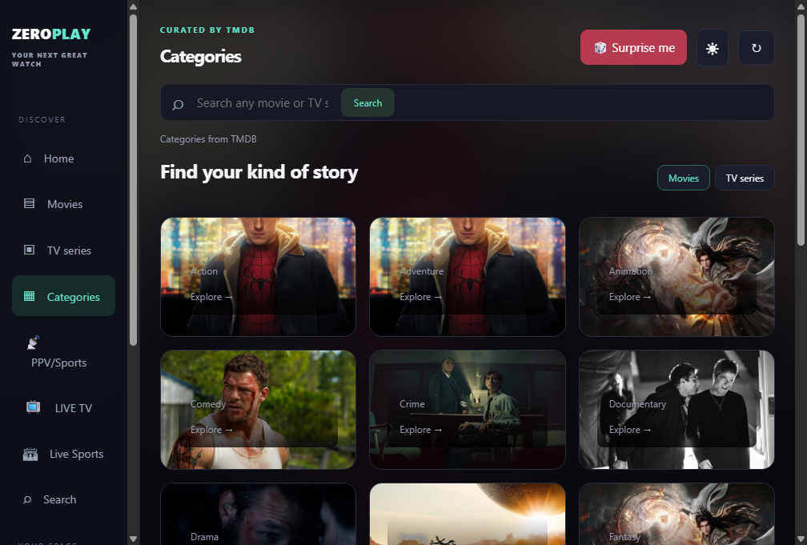](docs/screenshots/windows-categories.png)

### ⚙️ Your screen, your settings

Choose your playback source, appearance, provider region, and optional audio boost. Choose from 31 homepage panels, including all movie genres, with readable buttons and checkboxes in both themes.

[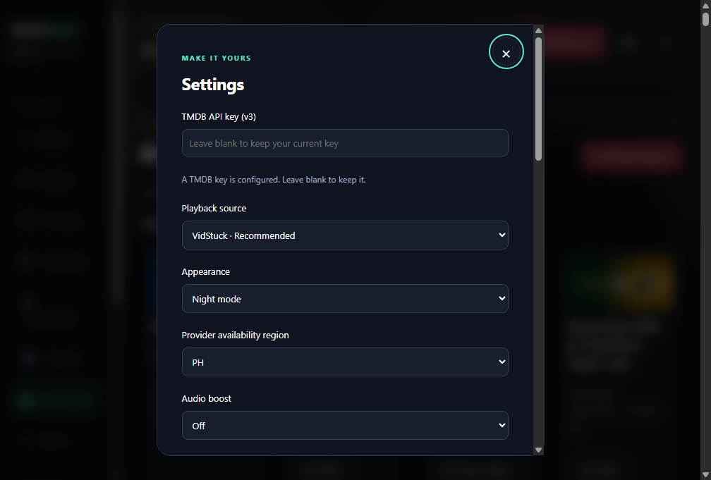](docs/screenshots/windows-settings.png)

[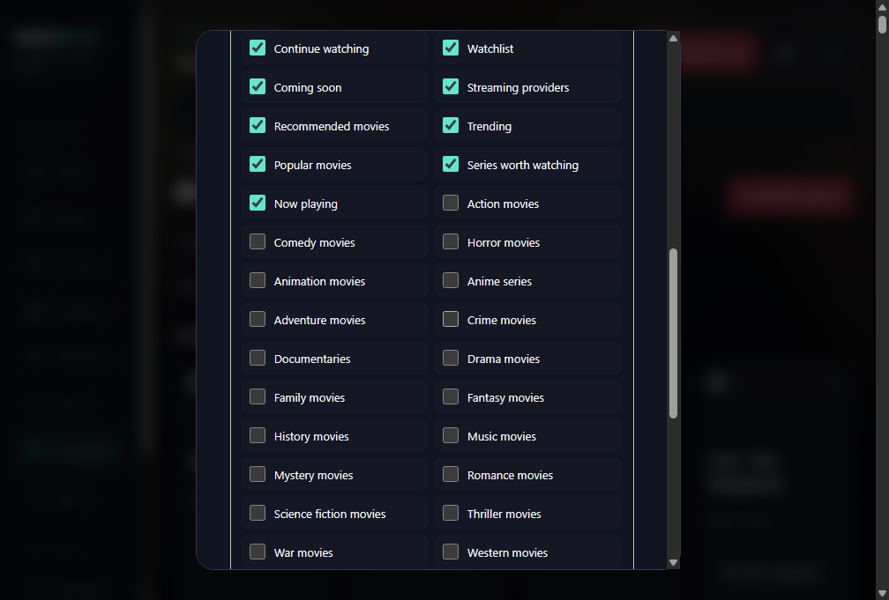](docs/screenshots/windows-home-panels.png)

<a href="docs/screenshots/android-mobile-home-panels.png">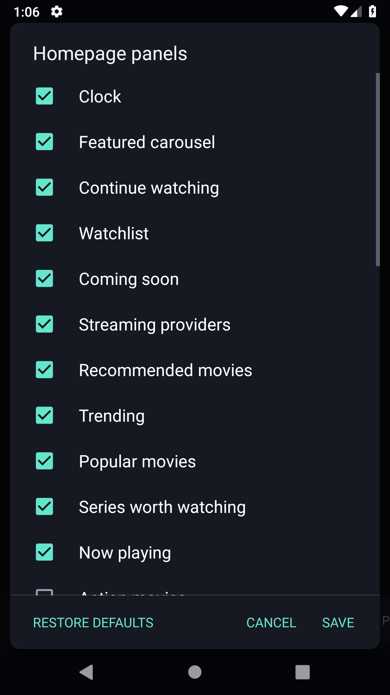</a>

[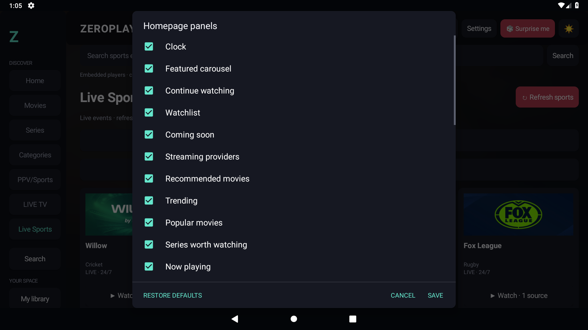](docs/screenshots/android-tv-home-panels.png)

📸 More Android and Windows feature screenshots

<a href="docs/screenshots/android-mobile-categories.png">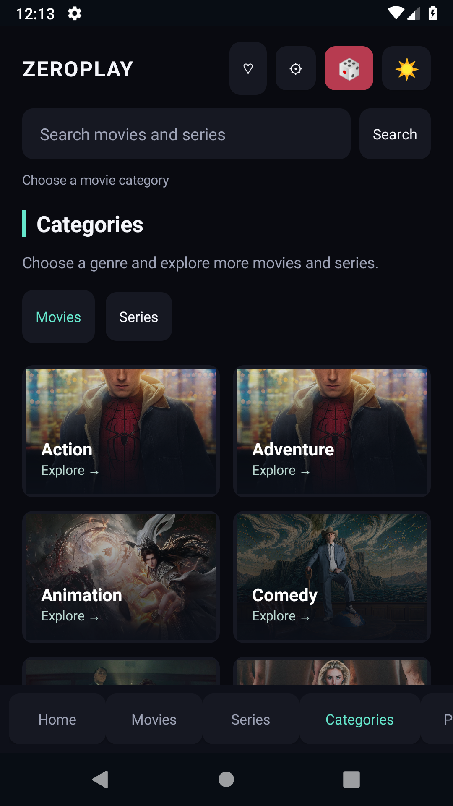</a>

<a href="docs/screenshots/android-mobile-live-sports.png">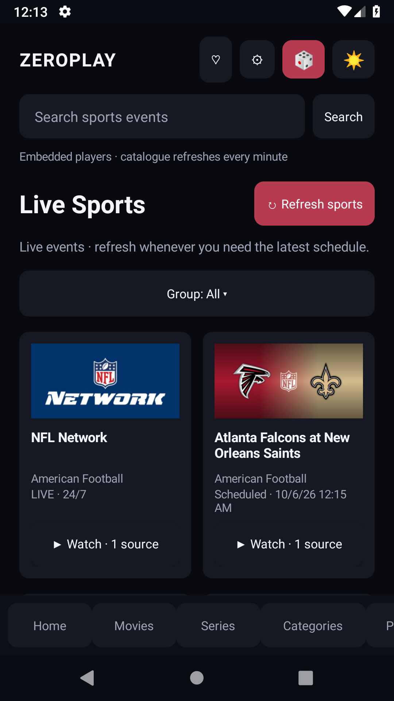</a>

[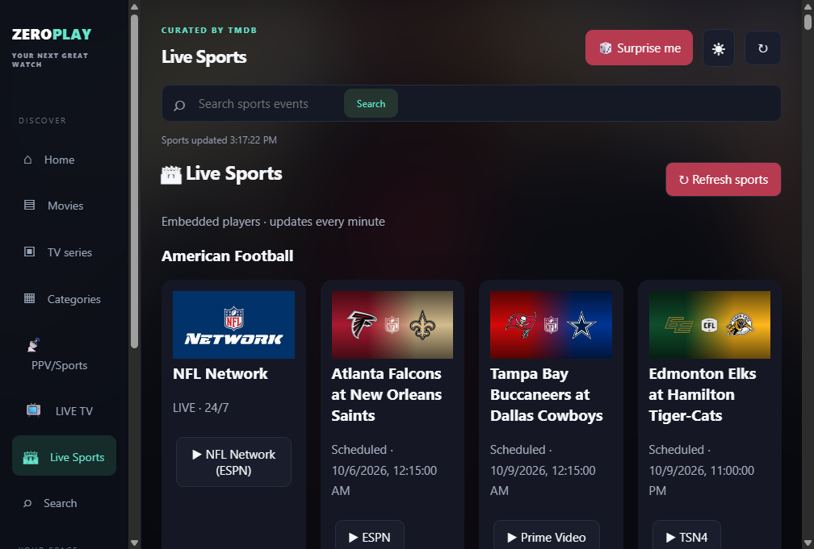](docs/screenshots/windows-sports.png)

[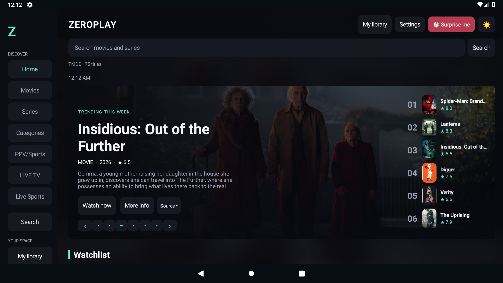](docs/screenshots/android-tv-home.png)

## ⬇️ Download & get started

Get the files from **[GitHub Releases](https://github.com/Zer0Spce/ZeroPlay/releases/latest)**.

| Platform | v1.6.1 download | Getting started |
| --- | --- | --- |
| 📱 Android phone / tablet | `ZeroPlay-1.6.1-Android.apk` | Android 6+. Install the signed mobile APK. |
| 📺 Android TV / Google TV | `ZeroPlay-1.6.1-Android-TV.apk` | Android 6+. Install the signed TV APK and navigate with your remote. |
| 🖥️ Windows 10 / 11 · x64 | `ZeroPlay-1.6.1-Windows-x64.zip` | Extract the ZIP and launch `ZeroPlay.exe`. |
| ✅ Integrity checks | `SHA256SUMS.txt` | Compare your downloaded files against the published SHA-256 checksums. |

Android v0.4.5 uses a permanent production signing key. Moving from an earlier debug build may require uninstalling that build first, which clears its local library and history. Future production releases retain the same signing key.

## 📺 Playback & your library

Android TV movie playback starts with **mouse mode enabled**: arrows move the cursor and OK clicks. Menu switches to D-pad focus and remembers your choice. Back hides visible controls first, and a second Back returns to browsing. See the [TV controls guide](docs/android-tv-controls.md).

Your watchlist, collections, history, and preferences are stored locally on the device. Resume positions and progress depend on provider events; titles without progress remain marked Started. Clearing watch history also clears resume positions.

TMDB metadata refreshes as you browse and on refresh, so new catalog entries do not require an app rebuild. Provider availability is region-specific and supplied through JustWatch/TMDB. A catalog listing does not guarantee playback availability or include a streaming subscription. Embedded-player support for progress, subtitles, audio boost, and advertisement filtering varies by provider and device WebView.

## 🛠️ Build & development

- **Android:** run **Build ZeroPlay APKs** manually in GitHub Actions for development APKs. The workflow tests both variants and uploads debug APKs plus APKs signed with the permanent Android key. Published production downloads remain in Releases.
- **Production:** **Release ZeroPlay** runs regressions, unit tests, builds, lint, non-debug checks, and signature verification before publishing signed APKs and checksums. Publishing waits for signed Android APKs, mobile/TV device tests, and a tested, Defender-scanned Windows portable ZIP. A previously tested Windows artifact is reusable only after its source identity and required checks are verified.
- **Windows:** see the [Windows guide](windows/README.md). Windows builds run manually on explicit request.
- **Website:** the responsive web version is prepared for Netlify. See [website setup](web/README.md).

For your own Android builds, add a TMDB v3 API key as the `TMDB_API_KEY` Actions secret. A nonempty key entered in app Settings overrides the bundled key. Client-side API keys can be extracted from APKs.

Production signing uses `ANDROID_KEYSTORE_BASE64`, `ANDROID_KEYSTORE_PASSWORD`, and `ANDROID_KEY_ALIAS`. Preserve a private backup and reuse the same key for updates. Keep signing keys and passwords out of source and public artifacts.

## 🙌 Credits

Metadata and artwork: **TMDB** and their respective rights holders. This product uses the TMDB API but is not endorsed or certified by TMDB. Provider availability: **JustWatch through TMDB**. Embedded players: **VidStuck, VidSrc.to, VidSrc.sh, and SuperEmbed**. QR decoding: **ZXing** (Apache 2.0). Android media playback: **AndroidX Media3**.

### 🛡️ Known QR ad bug

If a QR ad appears, press its **X** button or wait for it to close automatically. This is a known bug.

## 🆕 Version 1.6.0

🎮 Live Sports now uses compact bottom overlay controls that hide during playback. 🔤 Categories are alphabetical with six new language collections. ↕️ Sort loaded titles by popularity, rating, date or name, and sort channels and sports separately. 🏠 Fifteen more optional homepage genre panels keep the existing defaults. 🖼️ Fixed carousel geometry and portrait poster sizing, clearer settings colors, and uniform Windows navigation icons.

🛡️ Windows Live Sports uses a memory-only browser session with disk caching disabled and clears the retired sports browser cache at startup. Android sports playback bypasses and clears WebView cache.

### Live Sports

🏟️ **Live Sports is in Discover**, with ad filtering, blocked popups, blocked player file downloads, and fresh API refresh on every press. Anime, homepage panel settings, and LIVE TV favorites remain available.

### 🐛 Downloads temporarily disabled

Movie and torrent downloads are disabled because of bugs we have not been able to fix in the current implementation. The Downloads tab and download/save buttons are removed for now. We plan to reimplement them in a future version once a reliable fix is found. Existing downloaded files are not deleted by this update.

The reported **Trojan:Win32/Suschil!rfn** alert identifies a file under the legacy Windows `Partitions/live-sports/Cache/Cache_Data` directory. v1.6.0 removes that old sports cache and stops persisting the sports browser session. This does not identify the supplying request, prove a false positive, or certify third-party streams. Keep Defender enabled and remove/quarantine detected items; do not restore them or add an exclusion. Your watchlists and settings are retained.

### Version 1.6.1

Bug fixes.
