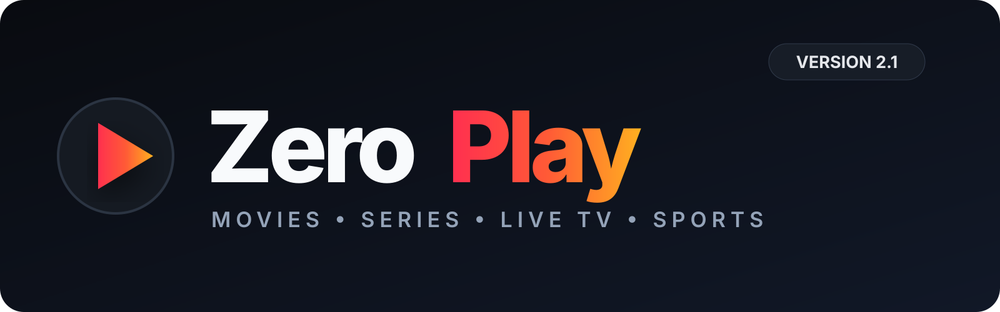
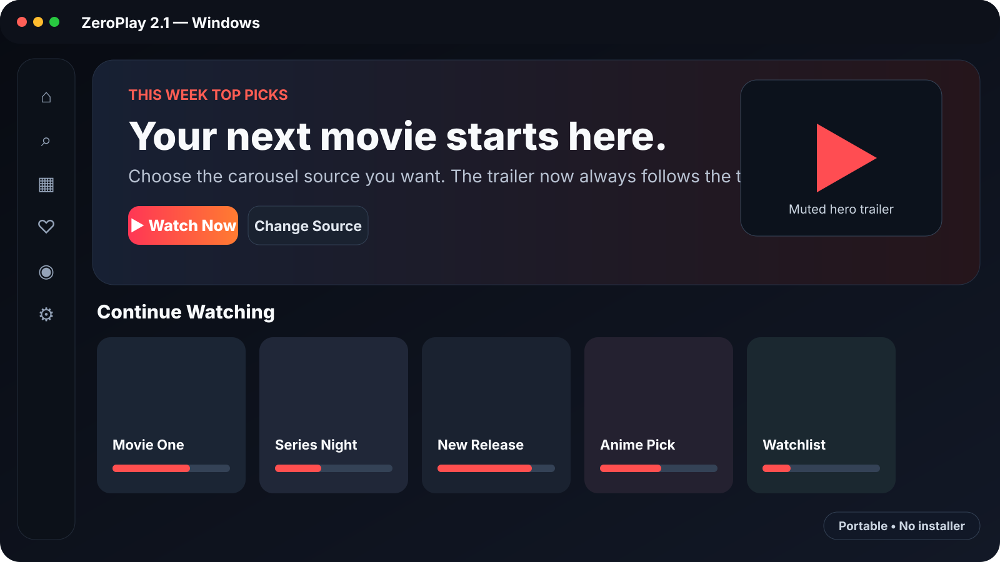
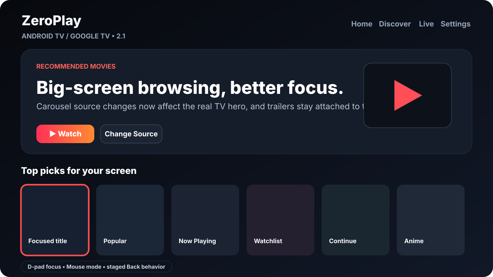
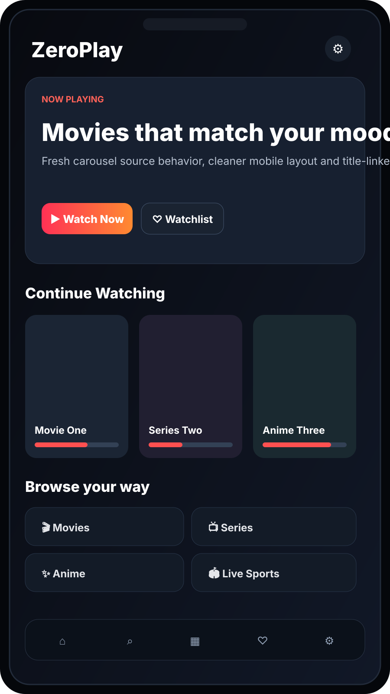

# ZeroPlay 2.1

### Movies. Series. Anime. Live TV. Live Sports. One app.

**ZeroPlay 2.1** is the current stable release for **Windows, Android, Android TV and Google TV**. It brings together TMDB-powered discovery, multiple playback sources, local watchlists/history, Live TV, PPV/Sports, Live Sports, downloads for authorized media, offline playback, subtitles, flexible UI layouts, themes and a repaired in-app update system.

**[⬇️ Download ZeroPlay 2.1](https://github.com/Zer0Spce/ZeroPlay/releases/tag/v2.1)** · **[📋 Full 2.1 release notes](docs/release-2.1.md)** · **[📺 Android TV controls](docs/android-tv-controls.md)**

> [!IMPORTANT]
> ### Windows 2.0 / 2.0.1 / 2.0.2 / 2.0.3 users must manually install 2.1 once
>
> Those versions contain the updater bug that **2.1 fixes**, so they should not be relied on to update themselves.
>
> **Download `ZeroPlay-2.1-Windows-x64.zip`, extract it to a fresh folder and launch `ZeroPlay.exe`. Once you are running 2.1, future Windows updates can be installed in-app.**

---

## ✨ ZeroPlay 2.1 at a glance

ZeroPlay 2.1 focuses on making the app feel finished: smoother navigation, cleaner UI behavior, a repaired Windows updater, better Android TV focus handling and consistent carousel behavior on every platform.

### 🎞️ Smarter homepage carousel

Choose exactly what appears in the hero carousel:

- **This Week Top Picks**
- **Watchlist**
- **Recommended Movies**
- **Popular Movies**
- **Now Playing**
- **Continue Watching**

The carousel supports up to **10 cards**, and the muted trailer now always follows the exact movie currently displayed. Android and Android TV now use the selected carousel source correctly instead of silently falling back to Trending.

### 📺 Better Android TV / Google TV navigation

- Stronger visible focus states throughout Settings and selectors
- Better Season / Episode focus, pressed and selected states
- Improved labels and sizing
- D-pad and Mouse player modes
- Staged Back behavior during playback
- Cleaner confirmation wording using **`No, Go Back`**
- Android TV carousel source changes now affect the real hero UI

### 📱 Cleaner Android phone / tablet experience

  

The mobile UI keeps the same ZeroPlay feature set while using a more polished touch-first layout with configurable home panels, categories, watchlist, history, Live TV, Live Sports and playback source controls.

### 🔄 Rebuilt Windows updater

ZeroPlay 2.1 replaces the fragile updater used by 2.0–2.0.3 with a dedicated **`ZeroPlayUpdater.exe`** helper.

- SHA-256 verification before activation
- Waits for ZeroPlay to close before installation
- Uses .NET ZIP extraction
- Installs new builds into `versions/<version>/`
- Atomically updates `current.json`
- Detached launcher handoff so the new version stays running
- Confirmation / rollback support for pending versions
- Automatic staging and `.download-*` cleanup
- `ZeroPlayUpdater-error.txt` on helper-level failure
- Windows portable package remains **installer-free**

The final updater architecture was validated using temporary newer-version update tests before 2.1 was published.

---

## 🚀 Everything ZeroPlay can do

| | Feature |
| --- | --- |
| 🔎 **TMDB discovery & search** | Trending, popular, now playing, upcoming, recommendations and explicit Search-button results. |
| 🎲 **Surprise Me** | Random released TMDB movie beyond the currently visible homepage. |
| 🗂️ **Categories** | Movie and TV genres, Anime, alphabetical browsing, language collections and infinite loading. |
| 🎞️ **Rich title pages** | Artwork, synopsis, genres, cast, trailers, ratings, recommendations and provider information. |
| 🧑‍🎬 **Clickable cast** | Browse combined movie + TV filmography using TMDB person IDs. |
| 🍅 **Ratings** | TMDB metadata plus Rotten Tomatoes through OMDb when configured. |
| ❤️ **Library** | Watchlist, Plan to Watch, custom collections, watch history and search history stored locally. |
| ⏯️ **Continue Watching** | Resume supported movies and episodes when providers report progress. |
| ▶️ **Playback sources** | VidStuck recommended, VidSrc.sh, plus optional RawCast playback with your own key. |
| 📡 **PPV / Sports** | Dedicated playlist browsing, refresh and in-app playback. |
| 📺 **Live TV** | IPTV groups, favorites, refresh and Windows controls for supported channel sets. |
| 🏟️ **Live Sports** | Event categories, schedules, alternate streams, retry/refresh and fullscreen playback. |
| 🎨 **Four UI layouts** | Clean, Modern, Flix and Native / Original. |
| 🌈 **17 themes** | Multiple dark, light and accent themes independent of layout choice. |
| 🎞️ **Configurable carousel** | Six source choices with up to 10 cards and matching trailer previews. |
| ✨ **Animation controls** | Optional UI animation, focus previews and muted homepage trailers. |
| ⚙️ **Homepage customization** | Toggle home panels and additional categories from Settings. |
| ♻️ **Reset application and settings** | Clears settings, library/history and API preferences while keeping downloaded media files. |
| 📥 **Downloads** | TSP Search configuration, healthy-result filtering, queue/progress, delete controls and history. |
| 💬 **Offline subtitles** | SRT, VTT, ASS and SSA support for downloaded media. |
| ↗️ **External player** | Open completed local downloads in an external video player. |
| 🛡️ **Adblock 2.0** | Known-network blocking, QR-ad learning, popup hardening and provider/CDN protection. |
| 🔊 **Audio boost** | Off / 1.5× / 2× where compatible. |
| 🔄 **In-app updater** | Repaired Windows updater plus Android and Android TV update flows. |
| 🖥️ **Windows portable** | No installer. Extract and run. |
| 🖥️ **True fullscreen** | Fullscreen the entire Windows UI while retaining scrolling. |
| 📺 **TV remote support** | Visible focus, D-pad navigation, Mouse mode and staged Back behavior. |

---

## 🎨 Four interfaces

Choose the layout under **Settings → Appearance → UI layout**.

| Layout | Experience | Default |
| --- | --- | --- |
| **Clean UI** | YouTube-TV-inspired navigation with a collapsible sidebar | **Windows** |
| **Modern UI** | Google-TV-inspired top navigation and portrait content cards | **Android phone / tablet** |
| **Flix UI** | Cinematic artwork-first presentation | Optional |
| **Native / Original UI** | Familiar ZeroPlay layout and TV focus flow | **Android TV / Google TV** |

---

## 📺 Android TV controls

### D-pad mode

- Arrow keys navigate player controls
- Visible focus shows the active control
- OK activates the selected control
- Hidden controls can be woken before navigation continues

### Mouse mode

- Arrow keys move ZeroPlay's virtual pointer
- OK clicks at the pointer
- Back closes an open player function/menu first
- With no function open, Back hides visible player controls
- The following Back exits playback

---

## 🛡️ Adblock 2.0

ZeroPlay favors confirmed evidence over aggressive guessing:

- Confirmed QR-ad hosts are quarantined for the current session
- Learned hosts expire instead of becoming permanent forever
- VidStuck, VidSrc.sh and common player/video CDN hosts are protected
- Block decisions can be logged locally with ruleset version + reason
- Popunder/new-window attempts are denied inside app playback
- CAPTCHA / Cloudflare / verification controls are not clicked, solved or removed by ZeroPlay

---

## ⬇️ Download ZeroPlay 2.1

Get the production files from **[GitHub Releases](https://github.com/Zer0Spce/ZeroPlay/releases/tag/v2.1)**.

| Platform | File | Getting started |
| --- | --- | --- |
| 📱 Android phone / tablet | `ZeroPlay-2.1-Android.apk` | Android 6+. Install the signed mobile APK. |
| 📺 Android TV / Google TV | `ZeroPlay-2.1-Android-TV.apk` | Android 6+. Install the signed TV APK and choose Mouse/D-pad mode in Settings. |
| 🖥️ Windows 10 / 11 x64 | `ZeroPlay-2.1-Windows-x64.zip` | **2.0–2.0.3 users: manual download required once.** Extract to a fresh folder and run `ZeroPlay.exe`. |
| ✅ Integrity | `SHA256SUMS.txt` | Verify the release files against the published SHA-256 hashes. |

### Windows upgrade note

If you are using **2.0, 2.0.1, 2.0.2 or 2.0.3 on Windows**, manually install 2.1 once. **After that, future Windows updates can use the repaired in-app updater.**

---

## ⚠️ Notes

**Windows SmartScreen:** builds without a trusted Authenticode certificate can still show an Unrecognized app warning even though the production pipeline scans the packaged Windows build with Microsoft Defender before publication.

**Embedded providers:** VidStuck and VidSrc.sh are third-party players and can change independently. Provider changes can temporarily affect controls, progress, subtitles or advertising behavior.

**Offline Player:** if local Windows playback controls are unreliable on a specific system, use **Open in external player** for the downloaded file.

---

## 🔧 Configuration

- **TMDB:** catalogue and metadata
- **OMDb:** optional Rotten Tomatoes ratings
- **TSP Search:** optional hosted search for authorized/public-domain/user-owned downloads
- **RawCast:** optional playback source using the user's own API quota
- **Live TV:** supported channel groups can be enabled independently where available

Use download functionality only for content you are authorized to obtain.

---

## 🧪 2.1 release validation

Before 2.1 was published, the production pipeline passed:

- Android Mobile + Android TV unit tests
- signed production APK builds
- Android lint
- APK signature/version verification
- Windows test suite
- Windows desktop smoke test
- standalone `ZeroPlayUpdater.exe` build
- portable-package validation
- Windows credential audit
- Microsoft Defender scan
- SHA-256 checksum generation
- final release publication only after all Android and Windows gates passed

**ZeroPlay 2.1 is the current stable release.**

---

## 🙌 Credits

Metadata and artwork: **TMDB** and their respective rights holders. This product uses the TMDB API but is not endorsed or certified by TMDB. Provider availability: **JustWatch through TMDB**. Optional ratings: **OMDb**. Embedded players: **VidStuck** and **VidSrc.sh**. QR decoding: **ZXing**. Android media playback: **AndroidX Media3**. Windows torrent engine: **WebTorrent**.

See **[ZeroPlay 2.1 release notes](docs/release-2.1.md)** for the complete 2.1 change record and Windows migration instructions.
