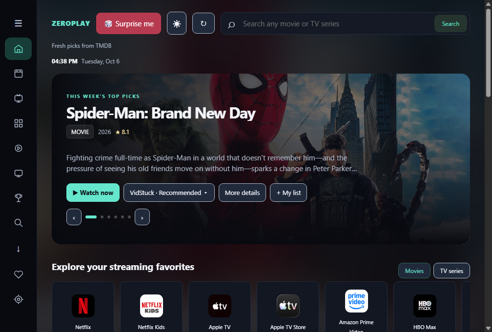
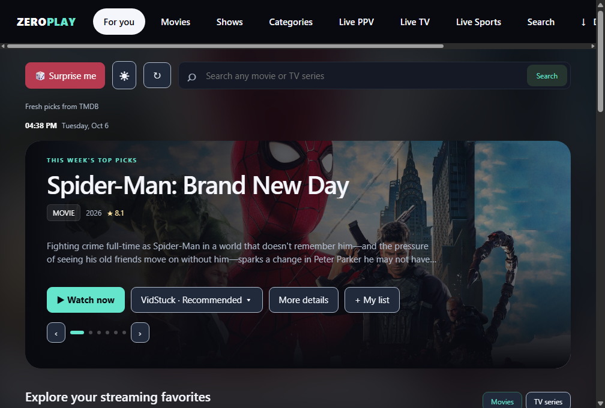
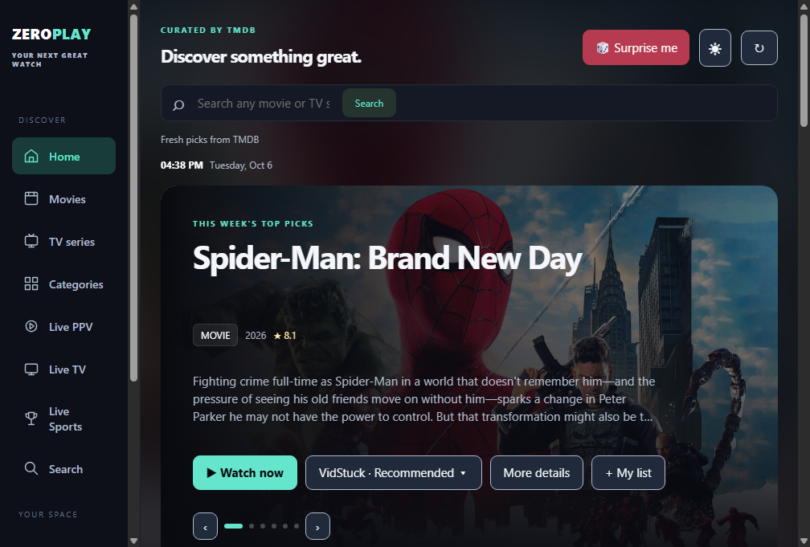

# 🎬 ZeroPlay 2.0

### Movies. Series. Live TV. Live Sports. Your screen, your way.

**ZeroPlay** is a cross-platform entertainment hub for **Android, Android TV / Google TV, and Windows**. Discover movies, TV series and anime through TMDB, keep a local library and history, switch playback sources, follow Live TV / PPV / Sports, download authorized media for offline playback, and customize the entire experience from one app.

**[⬇️ Download ZeroPlay 2.0](https://github.com/Zer0Spce/ZeroPlay/releases/tag/v2.0)** · **[📋 Full 2.0 release notes](docs/release-2.0.md)** · **[📺 Android TV controls](docs/android-tv-controls.md)**

> ZeroPlay 2.0 is the largest UI, TV-control, player, updater and reliability release since the ZeroMovies → ZeroPlay transition.

Production Android builds keep the established signing identity so supported production installs can update in place.

---

## ✨ What ZeroPlay can do

| | Feature |
| --- | --- |
| 🔎 **TMDB discovery & search** | Trending, popular, now playing, upcoming, recommendations and explicit Search-button results without searching every keystroke. |
| 🎲 **Surprise Me** | Pick a random released TMDB movie beyond the currently visible homepage. **Surprise Me Again** appears only when a title was opened through Surprise Me. |
| 🗂️ **Categories** | Artwork-rich movie and TV genres, Anime, alphabetical browsing and international/language collections with infinite loading. |
| 🎞️ **Rich title pages** | Artwork, synopsis, genres, cast, trailers, ratings, recommendations and provider information. |
| 🧑‍🎬 **Clickable cast & filmography** | Select a cast member to browse movie + TV combined credits using the exact TMDB person ID. |
| 🍅 **Ratings** | TMDB metadata plus Rotten Tomatoes through OMDb when an OMDb key is configured. |
| ❤️ **Library** | Watchlist, Plan to Watch, custom collections, watch history and search history stored locally. |
| ⏯️ **Continue Watching** | Resume supported movie / episode playback positions when the provider reports progress. |
| ▶️ **Playback sources** | VidStuck recommended, VidSrc.sh, plus optional RawCast playback when enabled with your own key. |
| 📡 **Live PPV** | Dedicated PPV/Sports playlist browsing with refresh and in-app playback. |
| 📺 **Live TV** | IPTV groups, favorites, refresh and independent Windows controls for Cignal and Converge channels. |
| 🏟️ **Live Sports** | Event categories, schedules, artwork, alternate streams, refresh/retry and fullscreen playback. |
| 🎨 **Four UI layouts** | Clean, Modern, Flix and Native / Original. Layout choice is independent from color theme. |
| 🌈 **17 themes** | Zero Dark, Zero Light, Ocean, Orchid, Sunset, Midnight Blue, Ember Glow, Forest Moss, Rose Noir, Amethyst, Cyber Mint, Cobalt Sky, Golden Hour, Coral Night, Aurora, Slate Ice and Mocha. |
| ✨ **UI animation controls** | Optional animations, focus/hover previews, focus trailers and a muted homepage trailer carousel. |
| ⚙️ **Homepage customization** | Enable/disable homepage panels and additional categories from Settings. |
| 📥 **Downloads** | Hosted TSP Search configuration, healthy-result filtering, integrated queue, progress/health/speed information, delete controls and completed-download history. |
| 💬 **Offline subtitles** | Local SRT, VTT, ASS and SSA support for downloaded media, including automatic matching where available. |
| ↗️ **External player** | Completed Windows/Android downloads can be opened in an external local video player. |
| 🛡️ **Adblock 2.0** | Known ad-network blocking, confirmed QR-ad learning, popup/navigation hardening, provider/CDN protection and expiring learned-host quarantine. |
| 🔊 **Audio boost** | Off / 1.5× / 2× on compatible embedded audio. |
| 🔄 **In-app updater** | Windows, Android and Android TV update flows with version/changelog handling. |
| 🖥️ **Windows portable** | No installer required. Extract the ZIP and run ZeroPlay. |
| 🖥️ **True app fullscreen** | Full-screen the entire Windows interface from the header while keeping scrolling available. |
| 📺 **Android TV remote support** | Settings-selected Mouse or D-pad mode, visible focus/navigation and staged Back behavior. |
| 🚪 **Exit confirmation** | Playback and application exit confirmations reduce accidental exits. |

---

## 🎨 Four interfaces

Choose the layout under **Settings → Appearance → UI layout**.

| Layout | Experience | Fresh-install default |
| --- | --- | --- |
| **Clean UI** | YouTube-TV-inspired navigation with a sidebar that collapses to an icon rail while browsing | **Windows** |
| **Modern UI** | Google-TV-inspired top navigation, cinematic discovery and portrait content cards | **Android phone / tablet** |
| **Flix UI** | Cinematic artwork-first presentation with isolated layout rules and overlapping shelves | Optional |
| **Native / Original UI** | The familiar ZeroPlay layout and Android TV focus flow | **Android TV / Google TV** |

### Clean UI

### Modern UI

### Native / Original UI

Flix is the fourth selectable layout and stays isolated so its cinematic CSS does not leak into Clean, Modern or Native.

---

## 📸 ZeroPlay across platforms

### 📱 Android

### 📺 Android TV / Google TV

### 🗂️ Categories

### 🏟️ Live Sports

### ⚙️ Settings & homepage customization

---

## 🚀 ZeroPlay 2.0 highlights

- 📺 **Android TV D-pad player navigation rewritten from scratch** around one clean input controller.
- 🖱️ **Mouse mode Back behavior fixed** — close the open player function first, hide controls next, then exit playback.
- 🎨 **Clean, Modern, Flix and Native / Original** layouts with platform-specific defaults.
- 🌈 **17 finalized color themes** and theme-aware ZeroPlay branding.
- 🔄 **Native update flows** for Windows, Android and Android TV.
- 🧑‍🎬 **Clickable cast and filmography** using exact TMDB identities and combined credits.
- 🍅 **Rotten Tomatoes ratings** through OMDb when configured.
- 🗂️ **Rebuilt Categories** with clearer artwork, international collections and Anime.
- 🛡️ **Adblock 2.0** with versioned rules, provider/CDN protection and expiring learned-host quarantine.
- 🖥️ **Windows app fullscreen** beside Surprise Me / Update.
- 🎬 **Rebuilt Windows Offline Player** with native/local playback and SRT/VTT/ASS/SSA handling.
- 🚪 **Playback and app exit confirmation** to prevent accidental exits.

<strong>🧰 Every fix and improvement since 1.9 (52 items)</strong>

1. **Windows updater rebuilt** — checks GitHub on launch and manually, shows version/changelog, supports Update / Cancel / Skip, download progress, verification and relaunch.
2. **Android / Android TV updater added** — checks the GitHub release, downloads the matching APK and hands it to the Android installer with TV/mobile-friendly controls.
3. **Windows Settings reorganized** into General, Home, Appearance, Experience, Playback & Downloads, Player and About while preserving existing handlers.
4. **Android / Android TV Settings cleanup** brought the same grouping and readability improvements to mobile/TV.
5. **Clean UI rebuilt around a YouTube-TV-style navigation model** with a full sidebar that collapses to a compact icon rail while browsing.
6. **Modern UI rebuilt around a Google-TV-style presentation** with balanced header/navigation, cinematic discovery and portrait cards.
7. **Flix UI added** as a fourth cinematic layout with isolated rules so it does not leak styling into other interfaces.
8. **Native / Original UI preserved** for users who prefer the classic ZeroPlay layout.
9. **Fresh-install defaults corrected:** Windows → Clean, Android phone/tablet → Modern, Android TV → Native / Original. Saved choices remain untouched.
10. **Modern Movies & Shows shelves made more compact** so more content fits naturally.
11. **Portrait vs. landscape card behavior corrected** across content sections.
12. **Carousel timing standardized to 15 seconds** with directional transitions that respect the UI Animations setting.
13. **17 exact themes finalized:** Zero Dark, Zero Light, Ocean, Orchid, Sunset, Midnight Blue, Ember Glow, Forest Moss, Rose Noir, Amethyst, Cyber Mint, Cobalt Sky, Golden Hour, Coral Night, Aurora, Slate Ice and Mocha.
14. **Theme-aware ZeroPlay branding added** so `Zero` remains primary while `Play` follows the accent color.
15. **Clickable cast added on Windows** using the exact TMDB person ID rather than name guessing.
16. **Clickable cast / filmography added on Android** using TMDB combined credits.
17. **Filmography pages corrected** to use combined movie + TV credits and the exact TMDB identity.
18. **Categories redesigned** with clearer artwork, alphabetical browsing, international/language collections and Anime.
19. **Surprise Me Again scoped correctly** so it appears only when a title was opened through Surprise Me.
20. **Rotten Tomatoes ratings added** through OMDb when `OMDB_API_KEY` is configured.
21. **Android TV Settings focus visibility fixed** so dropdowns and selectable settings clearly highlight the active choice.
22. **Android TV Home navigation restored** to normal Android focus dispatch after custom interception caused regressions.
23. **Android TV player mode made Settings-only** so Mouse / D-pad is no longer accidentally changed by a playback key.
24. **Android TV D-pad player navigation rewritten from scratch** with one TV input controller replacing competing handlers and iframe guesses.
25. **D-pad focus highlight cleaned up** with a slimmer teal treatment that also works with open Shadow DOM controls.
26. **D-pad left/right navigation no longer intentionally maps to provider seek actions** while navigating controls.
27. **Hidden-control wake handling rebuilt** so the first remote input restores provider controls before normal navigation continues.
28. **Android TV Mouse mode kept independent** from the D-pad controller; the smooth virtual pointer remains the Mouse-mode path.
29. **Mouse-mode Back sequence fixed:** close settings/quality/subtitle first, hide visible controls next, then exit playback.
30. **Slow embedded providers no longer cause Back to dump the user out of playback prematurely.**
31. **Playback exit confirmation added** with explicit `Yes, exit` / `No` choices.
32. **App exit confirmation added** to reduce accidental exits from the main application.
33. **Live TV reliability improved** with safer retry/error handling on Windows and Android.
34. **Cignal and Converge controls separated** so each provider can be enabled independently; Windows defaults both off while other channels remain available.
35. **Android TV icon centering corrected** across focusable navigation surfaces.
36. **Windows Flix top-right controls corrected** and kept isolated from the other layouts.
37. **Windows Offline Player rebuilt around local/native playback** with SRT/VTT/ASS/SSA parsing, controls, Fit / Fill, speed and fullscreen.
38. **Windows Offline Player compositor handling improved** with a Direct Composition video-overlay workaround for files that hid controls behind video.
39. **Manual Offline Player show/hide control added** as a fallback after automatic hide proved unreliable on some Windows media/compositor combinations.
40. **Windows app fullscreen button added** beside Surprise Me / Update, removing normal Windows chrome and the visual scrollbar while preserving scrolling.
41. **Live PPV / Live TV / Live Sports player behavior retained** while movie/offline-player work stayed isolated from those stacks.
42. **Adblock ruleset versioned** as `2.0-known-good-2026-10-08` so the known-good baseline is identifiable and reversible.
43. **Confirmed-host quarantine added:** a host positively identified by the QR scanner is blocked exactly for the rest of the session.
44. **Temporary learned ad-host list added:** confirmed hosts are remembered for seven days instead of becoming permanent forever.
45. **Explicit provider/CDN allowlist added** so VidStuck, VidSrc.sh and common player/video CDN hosts are protected from future ad-rule mistakes.
46. **Local adblock debug log added** with ruleset version, blocked host and reason for easier diagnosis without sending browsing data anywhere.
47. **Safer cosmetic ad cleanup added:** exact confirmed-host frame/container removal is attempted before the broader legacy QR fallback.
48. **Popunder/new-window hardening retained and reinforced** through denied popups, denied unsupported top-level redirects and allowlist-aware network rules.
49. **Windows adblock mirrors the learned-host model** with an expiring local learned-host file and rolling local debug log.
50. **QR confirmation never opens the QR destination and never interacts with CAPTCHA/verification controls.**
51. **Release/test coverage expanded** for the TV controller, Shadow DOM focus, staged Back behavior, adblock allowlist, ruleset version and exact-host quarantine.
52. **Windows portable packaging remains installer-free** and keeps normal browsing/playback in one application window.

---

## 📺 Android TV controls in 2.0

Player mode is selected in **Settings** and is no longer switched accidentally during playback.

### D-pad mode

- Arrow keys navigate real player controls.
- A slim teal focus treatment shows the active control.
- OK activates the selected control.
- Left/right navigation is intercepted by ZeroPlay while moving focus so navigation does not intentionally become a seek action.
- After the provider hides its controls, the first remote input wakes the player controls before navigation continues.

### Mouse mode

- Arrow keys move ZeroPlay’s virtual pointer smoothly.
- OK clicks at the pointer.
- Back closes an open player function/menu first.
- With no function open, Back hides visible player controls.
- The following Back exits playback.

Both modes use the same **exit confirmation** before playback is actually closed.

---

## 🛡️ Adblock 2.0

2.0 favors confirmed evidence over aggressive guessing:

- Confirmed QR-ad hosts are quarantined exactly for the current session.
- Confirmed learned hosts expire after seven days.
- VidStuck, VidSrc.sh and common player/video CDN hosts are explicitly protected.
- Block decisions are logged locally with ruleset version + reason.
- New-window/popunder attempts remain denied inside app playback.
- CAPTCHA / Cloudflare / verification controls are not clicked, solved or removed by ZeroPlay.

Known-good rollback state is preserved in the repository, including the dedicated stable 2.0 backup branch.

---

## ⬇️ Download ZeroPlay 2.0

Get production files from **[GitHub Releases](https://github.com/Zer0Spce/ZeroPlay/releases/tag/v2.0)**.

| Platform | File | Getting started |
| --- | --- | --- |
| 📱 Android phone / tablet | `ZeroPlay-2.0-Android.apk` | Android 6+. Install the signed mobile APK. |
| 📺 Android TV / Google TV | `ZeroPlay-2.0-Android-TV.apk` | Android 6+. Install the signed TV APK and choose Mouse/D-pad mode in Settings. |
| 🖥️ Windows 10 / 11 x64 | `ZeroPlay-2.0-Windows-x64.zip` | Extract the ZIP and launch `ZeroPlay.exe`. No installer required. |
| ✅ Integrity | `SHA256SUMS.txt` | Verify downloaded assets against the published SHA-256 hashes. |

The 2.0 production pipeline validates the signed Android APKs, runs player/input regressions, builds the Windows portable package, performs credential audits, scans the packaged Windows build with **Microsoft Defender**, generates checksums and only then publishes the release.

---

## ⚠️ Known issues & workarounds

### Windows Offline Player controls

Some Windows media/compositor combinations can still make the Offline Player control chrome unreliable after using its manual eye control. In the affected state, the eye control or subtitle overlay can also disappear.

**Workaround:** choose **Open in external player** from the completed download and use your preferred local player. The downloaded media file itself is unaffected.

### Windows SmartScreen

A Windows build without a trusted Authenticode signing certificate may show **Windows protected your PC / Unrecognized app**. The production workflow scans the packaged Windows build with Microsoft Defender before publication, but SmartScreen reputation still depends on trusted signing/reputation.

### Embedded providers

VidStuck / VidSrc.sh are third-party players and can change independently. Provider changes can temporarily affect control discovery, progress events, subtitles or advertising behavior.

### QR overlays

If a new creative is not yet recognized, close it with its own **X** or wait for it to expire. ZeroPlay deliberately does not bypass verification challenges.

---

## 🔧 Configuration notes

- **TMDB:** catalogue and metadata. A user-entered TMDB v3 key overrides a bundled key.
- **OMDb:** optional Rotten Tomatoes ratings when `OMDB_API_KEY` is configured.
- **TSP Search:** optional hosted torrent-search configuration for authorized/public-domain/user-owned downloads.
- **RawCast:** optional playback source, hidden/off by default and using the user’s own API quota.
- **Live TV:** Cignal and Converge can be enabled independently on Windows and are disabled there by default.

Use download functionality only for content you are authorized to obtain. Torrent health is an estimate and does not guarantee availability or speed.

---

## 🛠️ Build & release

- **Android:** `Build ZeroPlay APKs` runs player/input regressions, unit tests, builds, lint and signed update APK generation.
- **Windows:** `Build ZeroPlay Windows` runs unit/UI/player regressions, TMDB checks, a desktop smoke test and portable ZIP packaging.
- **Production:** the 2.0 release pipeline builds signed Android APKs, validates player behavior, builds/scans the Windows portable package, audits release files for credentials and publishes only after the gates pass.
- **Windows packaging:** portable ZIP only; no installer.

Production Android signing uses the established ZeroPlay keystore. Keep signing credentials private and backed up.

---

## 🙌 Credits

Metadata and artwork: **TMDB** and their respective rights holders. This product uses the TMDB API but is not endorsed or certified by TMDB. Provider availability: **JustWatch through TMDB**. Optional ratings: **OMDb**. Embedded players: **VidStuck** and **VidSrc.sh**. QR decoding: **ZXing**. Android media playback: **AndroidX Media3**. Windows torrent engine: **WebTorrent**.

See **[ZeroPlay 2.0 release notes](docs/release-2.0.md)** for the permanent 1.9 → 2.0 release record.
