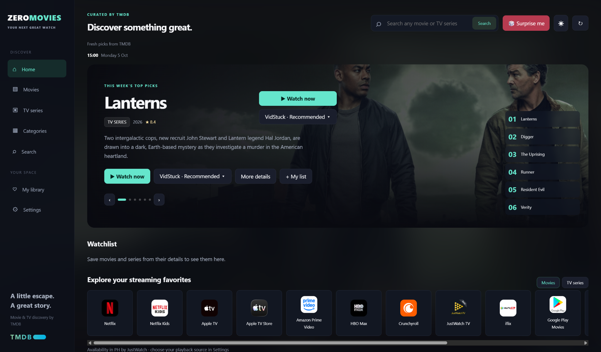
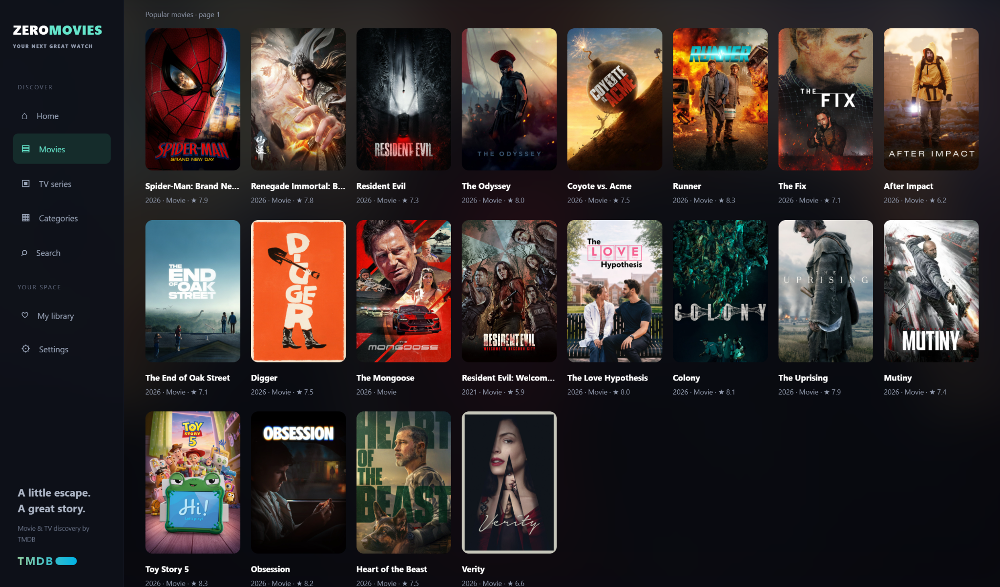
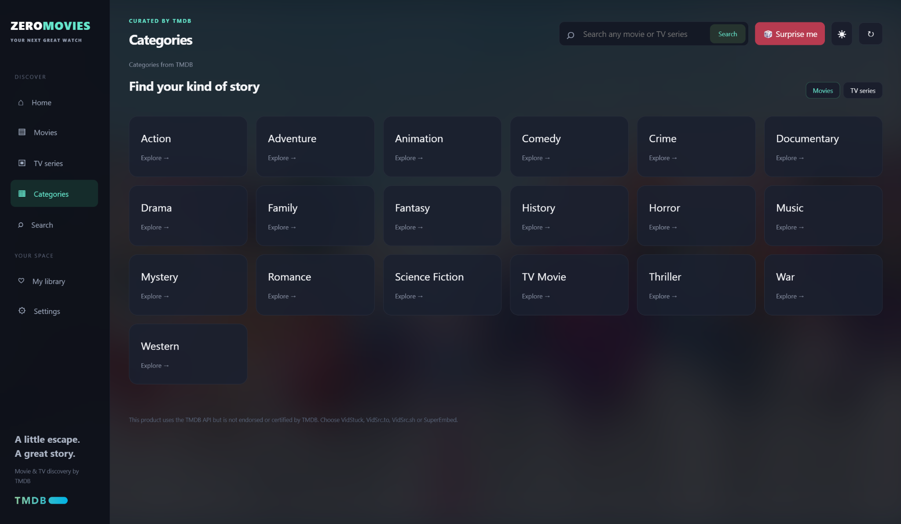

# 🎬 ZeroPlay

### Movies. Live TV. One place.

**Movies, series, LIVE TV, and PPV/Sports in one app.** ZeroPlay brings TMDB discovery, your personal library, and embedded playback together in a clean interface for **Android, Android TV / Google TV, and Windows**.

Browse trending picks, explore genres, save a watchlist, or roll the 🎲 **Surprise Me** dice when you cannot decide. Softly blurred artwork, light and dark themes, and dedicated TV controls make it comfortable on your phone, desktop, or big screen.

**[⬇️ Download the latest release](https://github.com/Zer0Spce/ZeroMovies/releases/latest)** · **[📋 v1.0.1 release notes](docs/release-1.0.1.md)** · **[📺 TV controls](docs/android-tv-controls.md)**

Previously **ZeroMovies**. ZeroPlay updates keep existing Android installations, Windows library data, and the permanent signing key.

## ✨ Features

| | What you can do |
| --- | --- |
| 🔎 **Discover & search** | Browse trending, popular, now-playing, recommended, and coming-soon titles, or search movies and TV series through TMDB. |
| 🎲 **Surprise Me** | Discover released movies beyond the homepage rows with the red dice button beside the theme toggle. |
| 🗂️ **Categories** | Explore movie and TV genres. v1.0 adds genre artwork and automatically loads more titles as you scroll. |
| 📡 **PPV/Sports & LIVE TV** | Two dedicated tabs using the ZeroStreams playlists, colored refresh buttons, channel groups, and in-app playback on Android, Android TV and Windows. |
| 🎞️ **Rich title details** | View artwork, ratings, synopsis, cast, genres, trailers, and related recommendations. |
| ▶️ **Choose your source** | Switch beside Watch Now between **VidStuck · Recommended**, VidSrc.to, VidSrc.sh, and SuperEmbed. |
| ❤️ **Your library** | Save a watchlist, organize collections and Plan to Watch, and revisit watch and search history. |
| ⏯️ **Continue Watching** | Return to started titles and resume where supported by the playback provider. |
| 🌗 **Make it yours** | Saved light/dark mode, a compact theme toggle, and subtle blurred backgrounds. |
| 🛡️ **Advertisement filtering** | Block known advertising requests and redirects, and remove explicit banner/ad slots, popups, and recognized timed QR overlays in supported app playback environments. |
| 📺 **TV remote support** | D-pad navigation and optional player mouse mode; idle controls hide and wake on remote input. |
| 🖥️ **Windows portable** | Browse and play in one window, use native fullscreen, and return with the player Back button. No installer. |
| 🔊 **Optional audio boost** | Off, 1.5×, or 2× for compatible embedded audio. |

v1.0 brings PPV/Sports and LIVE TV to Android, Android TV and Windows: search runs when you press **Search** (or the keyboard Search action), and movie, series, genre, provider, and search lists load more near the bottom without page buttons. The two live tabs include dedicated refresh controls and preserve saved channels when a refresh fails.

## 📸 A look inside

Original PNG screenshots are included at their native **2048-pixel width**, without resizing or recompression. Click an image to open it and inspect the full-size original.

### 🏠 Discover something great

Trending picks, quick playback, your watchlist, and provider discovery in one place.

### 🍿 Find your next movie

Browse a poster-rich catalog with title ratings and release years.

### 🗂️ Find your kind of story

Explore genres across movies and TV series.

## ⬇️ Download & get started

Get the files from **[GitHub Releases](https://github.com/Zer0Spce/ZeroMovies/releases/latest)**.

| Platform | v1.0.1 download | Getting started |
| --- | --- | --- |
| 📱 Android phone / tablet | `ZeroPlay-1.0.1-Android.apk` | Android 6+. Install the signed mobile APK. |
| 📺 Android TV / Google TV | `ZeroPlay-1.0.1-Android-TV.apk` | Android 6+. Install the signed TV APK and navigate with your remote. |
| 🖥️ Windows 10 / 11 · x64 | `ZeroPlay-1.0.1-Windows-x64.zip` | Extract the ZIP and launch `ZeroPlay.exe`. |
| ✅ Integrity checks | `SHA256SUMS.txt` | Compare your downloaded files against the published SHA-256 checksums. |

Android v0.4.5 uses a permanent production signing key. Moving from an earlier debug build may require uninstalling that build first, which clears its local library and history. Future production releases retain the same signing key.

## 📺 Playback & your library

Android TV movie playback starts with **mouse mode enabled**: arrows move the cursor and OK clicks. Menu switches to D-pad focus and remembers your choice. Back hides visible controls first, and a second Back returns to browsing. See the [TV controls guide](docs/android-tv-controls.md).

Your watchlist, collections, history, and preferences are stored locally on the device. Resume positions and progress depend on provider events; titles without progress remain marked Started. Clearing watch history also clears resume positions.

TMDB metadata refreshes as you browse and on refresh, so new catalog entries do not require an app rebuild. Provider availability is region-specific and supplied through JustWatch/TMDB. A catalog listing does not guarantee playback availability or include a streaming subscription. Embedded-player support for progress, subtitles, audio boost, and advertisement filtering varies by provider and device WebView.

## 🛠️ Build & development

- **Android:** run **Build ZeroPlay APKs** manually in GitHub Actions for development APKs. The workflow tests both variants and uploads debug APKs plus APKs signed with the permanent Android key. Published production downloads remain in Releases.
- **Production:** **Release ZeroPlay** runs regressions, unit tests, builds, lint, non-debug checks, and signature verification before publishing signed APKs and checksums. Publishing waits for signed Android APKs and a tested Windows portable ZIP from the same release run.
- **Windows:** see the [Windows guide](windows/README.md). Windows builds run manually on explicit request.
- **Website:** the responsive web version is prepared for Netlify. See [website setup](web/README.md).

For your own Android builds, add a TMDB v3 API key as the `TMDB_API_KEY` Actions secret. A nonempty key entered in app Settings overrides the bundled key. Client-side API keys can be extracted from APKs.

Production signing uses `ANDROID_KEYSTORE_BASE64`, `ANDROID_KEYSTORE_PASSWORD`, and `ANDROID_KEY_ALIAS`. Preserve a private backup and reuse the same key for updates. Keep signing keys and passwords out of source and public artifacts.

## 🙌 Credits

Metadata and artwork: **TMDB** and their respective rights holders. This product uses the TMDB API but is not endorsed or certified by TMDB. Provider availability: **JustWatch through TMDB**. Embedded players: **VidStuck, VidSrc.to, VidSrc.sh, and SuperEmbed**. QR decoding: **ZXing** (Apache 2.0). Android media playback: **AndroidX Media3**.

